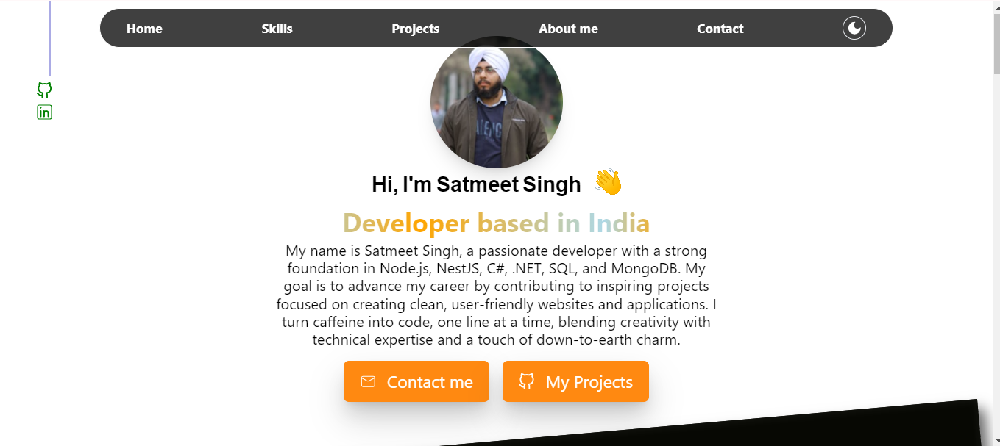

# Satmeet Singh's Portfolio

Welcome to my portfolio repository! This space highlights my projects, skills, and experience as a developer. Dive in to explore my work, and feel free to connect if you have any questions or ideas for collaboration.

## 📋 Table of Contents

- [About Me](#about-me)
- [Technologies & Skills](#technologies--skills)
- [Contact](#contact)

---

## 📖 About Me

Hello! I'm Satmeet Singh, a dedicated developer with expertise in both frontend and backend development. My goal is to bring ideas to life by solving complex challenges through thoughtful and effective solutions.

- **Location**: Ludhiana, Punjab 141013, India
- **Experience**: 1+ year in frontend (React.js) and backend (Nest.js)
- **Education**: Bachelor's in Electronics and Communication Engineering from NIT Kurukshetra
- **Interests**: Web Development, Problem-Solving

---

## 💻 Technologies & Skills

Here’s a quick overview of the technologies and tools I use:

- **Programming Languages**: JavaScript, C#
- **Frontend Development**: HTML, CSS, React.js
- **Backend Development**: Node.js, Express, .NET
- **Database Management**: SQL Server, MongoDB, PostgreSQL
- **DevOps & Tools**: Docker, Git, CI/CD
- **Other Tools**: VS Code, Postman, Jira

---

## 📞 Contact

I’m always open to collaborations, freelance projects, and professional connections. Feel free to reach out through any of the channels below:

- **Email**: [My Email](mailto:satmeetarora@gmail.com)
- **LinkedIn**: [My LinkedIn Profile](https://www.linkedin.com/in/satmeet-singh-a025a516a/)
<!-- - **Twitter**: [Your Twitter Profile](https://twitter.com/yourusername) -->

Thank you for exploring my portfolio! 😊
